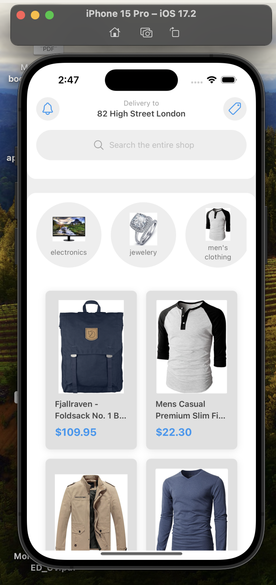
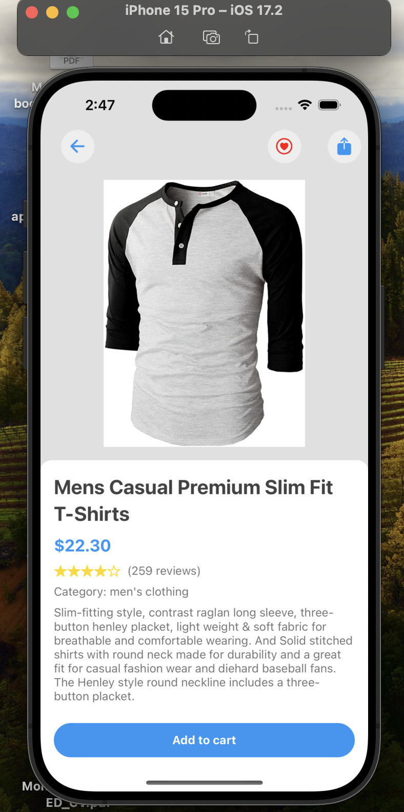
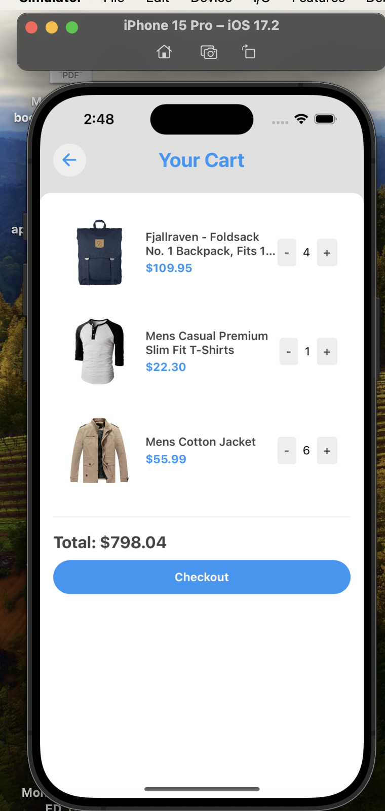

# Barakah E-commerce App

This is an e-commerce mobile application built with Expo and React Native for the Barakah Senior React Native Developer coding test.

## Prerequisites

Before you begin, ensure you have met the following requirements:

* You have installed [Node.js](https://nodejs.org/) (version 12 or later)
* You have installed [Yarn](https://yarnpkg.com/)
* You have installed [Expo CLI](https://docs.expo.dev/workflow/expo-cli/) globally

## Installing Barakah E-commerce App

To install the Barakah E-commerce App, follow these steps:

1. Clone the repository:
   ```
   git clone https://github.com/your-username/barakah-ecommerce-app.git
   ```
2. Navigate to the project directory:
   ```
   cd barakah-ecommerce-app
   ```
3. Install the dependencies:
   ```
   yarn install
   ```

## Running the Application

To run the Barakah E-commerce App, follow these steps:

1. Start the Expo development server:
   ```
   npx expo start
   ```
2. Once the server is running, you can run the app on:
   - An Android emulator
   - An iOS simulator
   - Your physical device using the Expo Go app

   Choose your preferred option from the menu in the terminal.

3. If you're using a physical device, scan the QR code displayed in the terminal with the Expo Go app (Android) or the Camera app (iOS).

## Project Structure

The main screens of the application are:

- `ProductListScreen.tsx`: Displays the list of products and categories
- `ProductDetailScreen.tsx`: Shows detailed information about a selected product
- `CartScreen.tsx`: Displays the user's shopping cart

The project uses NativeWind for styling and the Fake Store API (https://fakestoreapi.com/) as the backend service.

## App Screenshots

Here are some screenshots of the app in action:

### Product List Screen


This screen shows the main product listing page. It includes:
- A search bar for finding products
- Category filters at the top
- Product cards displaying images, names, and prices

### Product Detail Screen


The product detail screen provides more information about a specific item:
- Larger product image
- Product title and price
- Detailed description
- Option to add the item to the cart

### Cart Screen


The cart screen displays the items a user has added to their cart:
- List of cart items with images, names, and prices
- Quantity adjusters for each item
- Total price calculation
- Checkout button

## Contributing to Barakah E-commerce App

To contribute to the Barakah E-commerce App, follow these steps:

1. Fork the repository.
2. Create a new branch: `git checkout -b <branch_name>`.
3. Make your changes and commit them: `git commit -m '<commit_message>'`
4. Push to the original branch: `git push origin <project_name>/<location>`
5. Create the pull request.

Alternatively, see the GitHub documentation on [creating a pull request](https://help.github.com/articles/creating-a-pull-request/).

## Contact

If you have any questions or feedback, please contact the project maintainer at anas.almohammadi@barakah.app.

## License

This project uses the following license: [MIT License](https://opensource.org/licenses/MIT).
